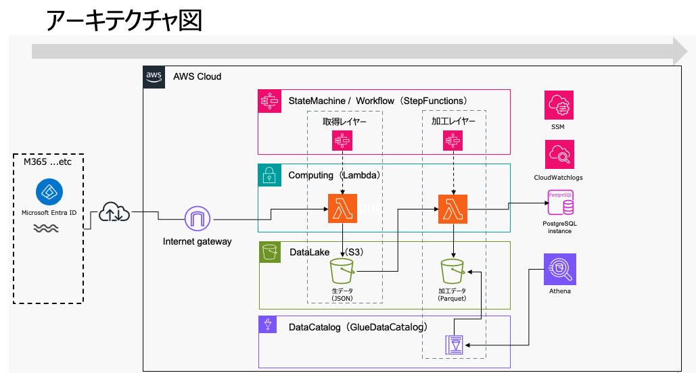

# DataPlatform

このリポジトリは、AWS上でのDataPlatform（データ基盤）を構築するためのサンプルである。
EntraID（フリーテナント）からユーザ・グループ情報を取得して、AWS上のデータレイク（S3）に
当該データを蓄積するとともにデータを加工して、分析用データベース（Postgres）へデータロードを行う。

## ライセンス

このリポジトリのコードは **MIT License** で配布している。

## 依存ライブラリとライセンス

このプロジェクトは以下の外部ライブラリを使用している。<br/>

[powershellプロジェクト]
| Library                   | License            |
|---------------------------|--------------------|
| AWS.Tools for Powershell  | Apache License 2.0 |
| Microsoft Graph PowerShell| MIT License        |
| Pester                    | Apache License 2.0 |

<br/>

[pythonプロジェクト]
| Library      | License                            |
|--------------|------------------------------------|
| boto3        | Apache License 2.0                 |
| pandas       | BSD 3-Clause License               |
| psycopg2     | LGPL v3 or Zope Public License (ZPL)|
| pytest       | MIT License                        |
| pyarrow      | Apache License 2.0                 |

各ライブラリの詳細については、それぞれのプロジェクトページを参照。
<br/>
## 本サンプルの前提条件
・　レイヤ、lambda関数のデプロイはSAMで実施する<br/>
・　EntraID（Freeで問題なし）テナントが利用できること<br/>
・　EntraID上でMicrosoft.Graphのアプリ登録が完了していること<br/>
・　EntraIDからAPI利用のための項目を取得し、AWS SSMパラメータストアに登録していること<br/>
|　パラメータストアパス　　　　　　| 種類　　　　　　|
|---------------------------|---------------|
|/m365/auth/tenantId　　　　　|　SecureString |
|/m365/auth/tokenEndpoint　　|　SecureString |
|/m365/auth/clientId　　　　　|　SecureString |
|/m365/auth/clientSecret　　　|　SecureString |
|/m365/auth/scope　　　　　　　|　SecureString |

・　Postgres（RDS）を利用するため、pythonディレクトリのddl.txtでtableを作成してること<br/>
・　DB接続用のパラメータをAWS SSMパラメータストアに登録してること<br/>

|　パラメータストアパス　　　　　　　　|　種類　        |
|-------------------------------|---------------|
|/m365/common/pg/group1/pguser　|　SecureString　|
|/m365/common/pg/group1/pgpasswd|　SecureString |
|/m365/common/pg/group1/pghost	|　String　　　　 |
|/m365/common/pg/group1/dbname	|　String　　　　 |
|/m365/common/pg/group1/schema	|　String　　　　 |

・　そのほか本サンプルのLambdaが必要とするパラメータをAWS SSMパラメータストアに登録してること<br/>

|　パラメータストアパス   　　　　|　用途　　 |　種類         　　　　　   　|
|----------------------------|---------|----------------------------
|/m365/common/pipelinecol　　|　String　|　データ取得用S3パーティション　|
|/m365/common/pipelineconv　|　String　 |　データ加工用S3パーテション　　|
|/m365/common/s3bucket　　　　|　String |　S3バケット　　　　　　　　　　|


<br/>
・　本サンプルのLambdaは基本、VPC外でデプロイしている。しかし、RDS接接のLambdaはVPC接続が必要なため、「s3convtopg.py」のみVPCにデプロイしている。LambdaとRDS接続のために、VPCエンドポイント（com.amazonaws.ap-northeast-1.ssm）の配備は事前に行うこと

## 構築方法
### powershell
（１）ディレクトリ構成
    
```
powershell
├── aws-lambda-powershell-runtime（Powershellレイヤー）
├── M365Common
├── M365GetGroup
├── M365GetUser
```
<br/>
（２）レイヤービルド・デプロイ<br/><br/>
　a）githubからlambda_powershellカスタムランタイム資材をダウンロード（powershellディレクトリへの配置を想定）<br/><br/>

``` 
git clone https://github.com/awslabs/aws-lambda-powershell-runtime.git
```      
<br/>
　b）展開されたディレクトリに移動<br/><br/>

```
cd aws-lambda-powershell-runtime/powershell-runtime
```

<br/>
　c）powershell-runtime/template.yamlから、レイヤー名を任意の名前に変更<br/>
　　　Resource:配下のPwshRuntimeLayer:を変更<br/>
　　　ContentUri:を記載のとおり更新<br/><br/>

```
# template.yamlの中身（サンプル）
AWSTemplateFormatVersion: '2010-09-09'
Transform: AWS::Serverless-2016-10-31
Description: aws-lambda-powershell-runtime

Resources:
  SimPwshRuntimeLayer:
    Type: AWS::Serverless::LayerVersion
    Properties:
      Description: Lambda Layer containing PowerShell
      ContentUri: ./layers/runtimeLayer
      CompatibleRuntimes:
        - provided.al2
        - provided.al2023
      RetentionPolicy: Delete
    Metadata:
      BuildMethod: makefile
```
<br/><br/>
　d）powershell-runtime/samconfig.tomlに対して、SAMデプロイのためのAWS各種情報更新<br/><br/>
　e）Powershellレイヤーをビルド（以下オプションは適宜環境に合わせて設定）
       
```
./build-PwshRuntimeLayer.ps1 -PwshArchitecture arm64 -PwshVersion 7.5.2 
```
<br/>
　f） 必要なPowershellモジュールをローカルでインストール。それをtemplate.yamlのContentUriに記載したディレクトリにコピー。<br/>
　　　　　以下例は、ContentUriにlayers/runtimeLayerとしているため、そのディレクトリ配下のmodulesディレクトリにコピーしている。<br/>
　　　　　ローカルにインストールされたPowershellモジュールのありかは、$env:PSModulePathで確認。<br/><br/>

```
cd ./aws-lambda-powershell-runtime/powershell-runtime/layers/runtimeLayer/modules
Install-AWSToolsModule AWS.TOOLS.COMMON -Scope CurrentUser -Force
Install-AWSToolsModule AWS.TOOLS.S3 -Scope CurrentUser -Force
Install-AWSToolsModule AWS.TOOLS.SimpleSystemsManagement -Scope CurrentUser -Force
Install-AWSToolsModule AWS.TOOLS.Lambda -Scope CurrentUser -Force
Copy-Item -Recurse ~/.local/share/powershell/Modules/AWS.TOOLS. ./
```
<br/>
　g）レイヤーデプロイ（template.yaml、samconfig.tomlがある場所へ移動）<br/><br/>
       
```
sam deploy
```

<br/>
（補足）<br/>
　コンテナイメージを使用したLambda関数も参考までに用意。M365GetUser-Dockerディレクトリに格納。処理自体は、M365GetUserと同じもの。<br/>
  こちらもsamビルドとsamデプロイで構築できるようサポート。
<br/>

### python
（注） ここでは、pythonレイヤーのビルドはdockerを使用している前提で説明。makefileでもビルドは可能だが説明は割愛。<br/><br/>
（１）ディレクトリ構成<br/>
```
python
├── layers_work（Pythonレイヤー）
├── M365Common
├── M365ConvGroup
├── M365ConvUser
├── S3TOPG
```
<br/>
（２）レイヤーディレクトリを作成（プロジェクトルート）<br/><br/>
    
```
 mkdir -p layers_work/layers/PythonLayer/
```
<br/>
（３）pythonモジュールインストールのため、requirements.txtをPythonLayerディレクトリに格納。<br/>
　　　必要なライブラリをrequiments.txtに追加<br/><br/>

```
layer_work/layers/PythonLayer/requirements.txt
```
<br/>
（４）template.yamlをレイヤー用に追加<br/>
    
```
layer_work/template.yaml

# template.yamlの中身（サンプル）

AWSTemplateFormatVersion: '2010-09-09'
Transform: AWS::Serverless-2016-10-31
Description: Python Layer

Resources:
  PythonLayer:
    Type: AWS::Serverless::LayerVersion
    Properties:
      LayerName: SimPythonRuntimeLayer
      ContentUri: layers/PythonLayer/
      CompatibleRuntimes:
        - python3.13
      CompatibleArchitectures:
        - arm64
    Metadata:
        BuildMethod: python3.13
        BuildArchitecture: arm64
```
<br/>
（５）dockerを起動していることを確認し、レイヤービルドを行う。必要なモジュールもここでインストールされる。<br/>
　　　template.yamlやsamconfig.tomlは事前に準備していること。<br/><br/>

```
sam build --use-container
```
<br/>
（６）できあがったレイヤーをデプロイ<br/><br/>

```
sam deploy
```
<br/>

### lambdaデプロイ

各lambda関数を格納しているディレクトリ単位で、template.yamlとsamlconfig.tomlを設定・格納して、以下コマンドでデプロイする。<br/><br/>

```
sam deploy --parameter-overrides LayerVersion="レイヤー番号"
```
### アーキテクチャイメージ


