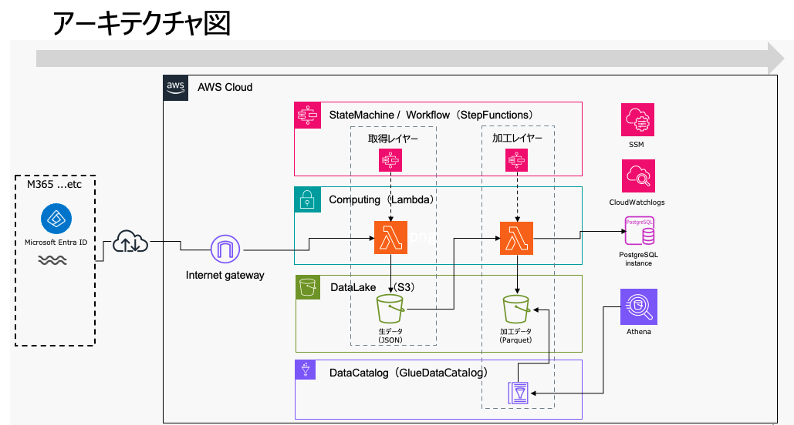

# DataPlatform

このリポジトリは、AWS上でのDataPlatform（データ基盤）を構築するためのサンプルである。
EntraID（フリーテナント）からユーザ・グループ情報を取得して、AWS上のデータレイク（S3）に
当該データを蓄積するとともにデータを加工して、分析用データベース（Postgres）へデータロードを行うとともに、カタログ化を行い、Athenaでクエリができるようにするサンプルを提供している。

### アーキテクチャイメージ

